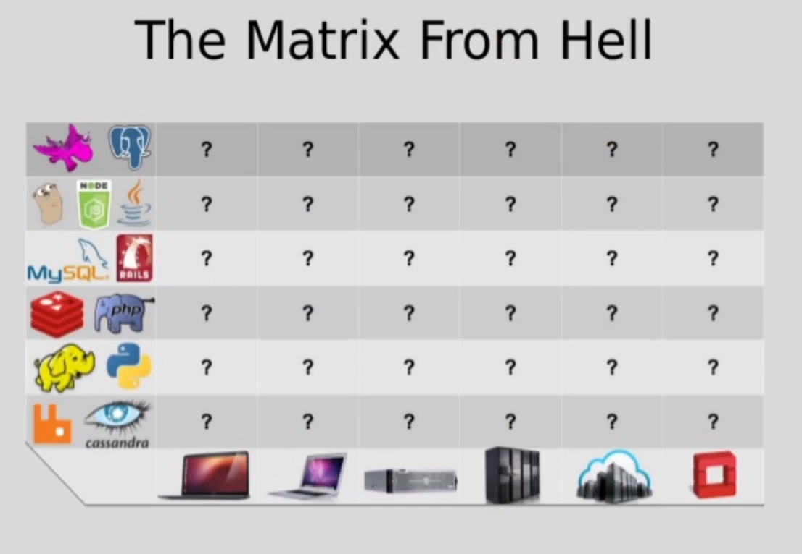

# Docker | Kubernetes

Estudo de ferramentas do Docker e Kubernetes em acompanhamento do curso [Docker para Desenvolvedores (com Docker Swarm e Kubernetes)](https://www.udemy.com/course/docker-para-desenvolvedores-com-docker-swarm-e-kubernetes/).
]
Arquivos utilizados no decorrer do curso: https://github.com/matheusbattisti/curso_docker.

## Introdução

### O que é Docker?
O Docker é um software que reduz a complexidade de setup de aplicações.
É onde configuramos containers, que funcionam com servidores para rodar nossas aplicações.
Permite criar ambientes independentes e que funcionam em diversos SO's com facilidade.

### Por que Docker?
O Docker proporciona mais velocidade na configuração do ambiente. Proporciona maior performance para executar uma aplicação do que uma Virtual Machine.

Nos livra da Matrix from Hell.
Numa empresa podem existir diversos projetos utilizando tecnologias distintas, estes projetos devem funcionar em diversos ambientes, por exemplo, na máquina dos desenvolvedores, ambiente de homologação, produção, etc. A mesma aplicação acaba sendo instalada de formas diferentes em váriso ambientes. Dessa forma a alteração de versão de uma tecnologia, ou adição de uma nova stack torna necessária alterações em todos os ambientes. O ingresso de um novo desenvolvedor demanda um dia de trabalho ou mais apenas para instalação da stack do ambiente de desenvolvimento. Com o Docker é possível configurar as imagens de ambiente de cada aplicação e executar os containers necessários.

No Windows indica-se o `Cmder` como alternativa ao terminal, pois simula um terminal de Linux, aceitando todos os comandos compatíveis com o Docker também.

## Trabalhando com Containers

Container é um pacote de código que pode executar uma ação. Containers utilizam imagens para serem executados.
 Imagem  é o "projeto" que será executado pelo container, todas as instruções ficam declaradas nela.

Container é o Docker executando uma imagem.

Repositório Docker para encontrar imagens: https://hub.docker.com/.

### Container vs Virtual Machine (VM)

Container é uma aplicação que serve para um detemrinado fim. Seu tamanho é de MBs. Utilizam menos recursos e tem usos específicos, isolando funcionalidades.  
Já uma VM possui sistema operacional próprio, tamanho de GBs e pode executar diversas funções ao mesmo tempo, utilizando mais recursos.

### Alguns comandos

 - Verificar containers executados
   - `docker ps` ou `docker container ls` - exibe containers em execução
   - `docker ps -a` ou `docker container ls -a` - exibe todos os containers já executados.
  
 - Modo interativo
   - `docker run -it <imagem>`, a flag `-it` pode ser adicionada ao comando `run` possibilita executar comandos disponíveis no container através de terminal interativo, ex.: `docker run -it node`.

 - Execução em background
   - `docker run nginx -d`, ao adicionar a flag `-d` (detached) o temrinal fica livre para receber novos comandos.

 - Expondo porta
   - containers docker não tem conexão com nada externo a eles. A flag `-p <porta_local_de_acesso>:<porta_do_container>` expõe portas para que o container fique acessível, ex.: `docker run -d -p 3000:80 nginx`, senod possível acessar o serviço em "http://localhost:3000".

 - Parando containers
   - `docker stop <id ou nome>`, para a execução do container e libera recursos por ele utilizados

 - Reiniciando containers
   - `docker start <id ou nome>` volta a execução de um container. O comando `run` sempre cria um container novo.

 - Definindo nome do container
   - Adicionando a flag `--name` ao comando "run" definimos um nome, se não colocarmos o container recebe um nome aleatório, ex.: `docker run -d -p 80:80 --name nginx_app nginx`.

 - Verificando logs de um container
   - Podemos verificar o que aconteceu em um container através do comando `docker logs <id ou nome>`.
   - `docker logs -f <id ou nome>`, com a flag "-f" (follow) mostra os logs em tempo real. Ctrl+C para sair.

 - Removendo containers
   - `docker -rm <id ou nome>`. Se o container estiver em execução podemos adicionar a flag `-f`(force) que para o container e em seguida o remove da memória local, ex.: `docker -rm <id ou nome> -f`.

[docker run command line documentation](https://docs.docker.com/engine/reference/commandline/run/).

## Imagens

Imagens são originadas de arquivos programados para que o Docker crie uma estrutura, essa estrutura pode execitar determinadas ações em containers.
Ao executar um container baseado numa imagem, as instruções serão executadas em camadas. Por exemplo, caso haja uma alteração no arquivo Dockerfile na linha _x_, apenas dessa linha em diante é que as instruções serão reexecutadas.

Imagens podem ser baixadas em https://hub.docker.com, porém qualquer pessoa pode fazer upload de uma imagem, portanto é importante observar imagens oficiais, quantidade de downloads e quantidade de stars para então optar pela utilização de uma imagem específica.

